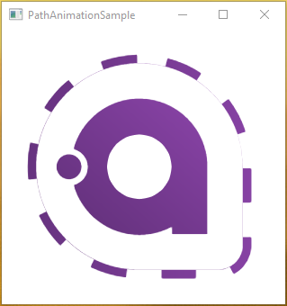

# Tims.Avalonia.Samples
A collection of some sample Apps

----------

## Change Content based on Enum-Value

This sample shows how to change the content of a control based on an enum value. We use `IDataTemplate` to achieve this. 

[Source](src/ChangeContentBasedOnEnumSample)

-------- 

## Path Animation Sample

Shows how to animate a path dash array via `Style`

[Source](src/PathAnimationSample)

-------- 

## Localization sample

This sample shows how you can use DynamicResource to translate the UI. 

[Source](src/LocalizationSample)

[read more about it here](https://www.codeproject.com/Articles/5317972/Theming-and-Localization-Functionality-for-Multipl)

## Animate fill level sample

We can't animate a progress bar value as it is a direct property, but we can animate the width or height of the progress bar. 

[Source](src/AnimateFillLevelSample)

[read more about it here](https://docs.avaloniaui.net/docs/animations/transitions)

